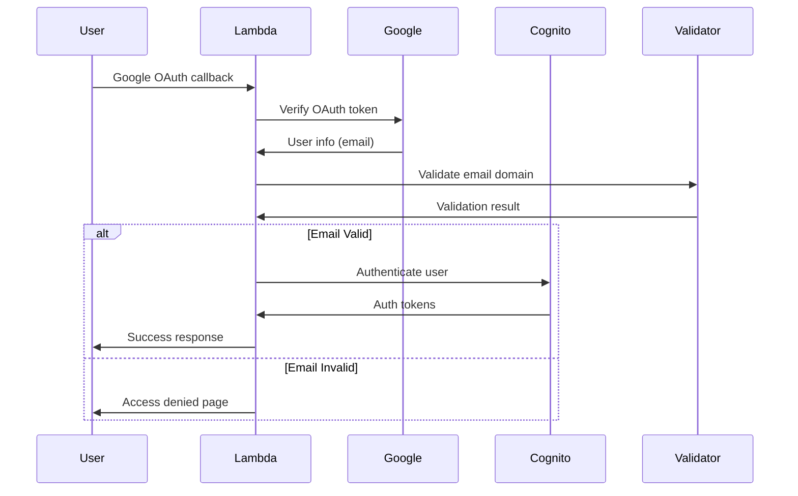

# GleamOrb Amplify-like Authentication with Google Workspace Validation

This project provides an AWS Lambda-based authentication system with Google Workspace email domain validation. Only users from approved email domains can authenticate through Google OAuth.

## 🚀 Features

- **Google Workspace Email Validation**: Restricts authentication to approved email domains
- **AWS Cognito Integration**: Seamless integration with AWS Cognito User Pools
- **Private API Gateway**: VPC-based private API for enhanced security
- **Flexible Configuration**: Domain and email restrictions configurable via AWS Secrets Manager
- **Comprehensive Logging**: Detailed logging for authentication attempts and validation results
- **HTML Response Pages**: User-friendly success and access denied pages

## 📁 Project Structure

```
src/main/java/com/gleamorb/lambda/
├── handlers/
│   └── AuthHandler.java                    # Main Lambda handler (refactored)
│   └── ResponseHelper.java                 # Enhanced response utilities
├── auth/
│   ├── validators/
│   │   ├── EmailValidator.java             # Core email domain validation
│   │   └── EmailValidationResult.java     # Validation result object
│   └── services/
│       └── WorkspaceAuthService.java       # Workspace authentication service
└── test/java/com/gleamorb/lambda/auth/validators/
    └── EmailValidatorTest.java             # Unit tests for email validation
```

## 🔧 Configuration

### Environment Variables

The Lambda function accepts the following environment variables:

| Variable | Description | Example |
|----------|-------------|---------|
| `WORKSPACE_AUTH_ENABLED` | Enable/disable workspace validation | `true` |
| `ALLOWED_EMAIL_DOMAINS` | Comma-separated list of allowed domains | `gleamorb.com,company.com` |
| `ALLOWED_EMAILS` | Comma-separated list of specific allowed emails | `admin@external.com,consultant@another.com` |
| `SECRET_NAME` | AWS Secrets Manager secret name | `dev-gleamorb-auth-secrets` |

### AWS Secrets Manager Configuration

The system also reads configuration from AWS Secrets Manager. The secret should contain:

```json
{
  "client_secret": "cognito_client_secret",
  "google_client_id": "google_oauth_client_id",
  "google_client_secret": "google_oauth_client_secret",
  "auth_library_version": "2.1.0",
  "stage": "dev",
  "workspace_auth_enabled": true,
  "allowed_domains": ["gleamorb.com", "company.com"],
  "allowed_emails": ["admin@external.com", "consultant@another.com"]
}
```

## 🏗️ Deployment

### Prerequisites

1. AWS CLI configured
2. SAM CLI installed
3. Java 11 JDK
4. Maven 3.6+

### Deploy with SAM

1. **Build the project:**
   ```bash
   mvn clean package
   ```

2. **Deploy using SAM:**
   ```bash
   sam deploy --guided --template-file template.yaml
   ```

3. **Provide parameters:**
   - `Stage`: Deployment environment (dev/staging/prod)
   - `VpcId`: Your VPC ID
   - `SubnetId1`, `SubnetId2`: Private subnet IDs
   - `ApiGatewayVpcEndpointId`: VPC endpoint for API Gateway
   - `CognitoUserPoolId`: Existing Cognito User Pool ID
   - `GoogleClientId`, `GoogleClientSecret`: Google OAuth credentials
   - `AllowedEmailDomains`: Comma-separated list of allowed domains
   - `AllowedEmails`: Comma-separated list of specific allowed emails

### Sample Deployment Command

```bash
sam deploy \
  --template-file template.yaml \
  --stack-name gleamorb-auth-workspace-dev \
  --parameter-overrides \
    Stage=dev \
    VpcId=vpc-12345678 \
    SubnetId1=subnet-12345678 \
    SubnetId2=subnet-87654321 \
    ApiGatewayVpcEndpointId=vpce-12345678 \
    CognitoUserPoolId=us-east-1_ABCDEFGHI \
    CognitoUserPoolClientId=abcdefghijklmnop \
    CognitoUserPoolClientSecret=secret123 \
    GoogleClientId=google-client-id \
    GoogleClientSecret=google-client-secret \
    AllowedEmailDomains=gleamorb.com,company.com \
    WorkspaceAuthStrict=true \
  --capabilities CAPABILITY_IAM
```

## 🔌 API Endpoints

### Health Check
- **GET** `/auth/health`
- Returns system health and workspace authentication configuration

### Google Authentication
- **GET/POST** `/auth/google/login`
- **GET/POST** `/auth/google/callback`
- Enhanced with workspace email validation

### Workspace Management (Admin)
- **GET** `/auth/workspace/domains`
- Returns workspace authentication configuration (requires IAM auth)

### Token Management
- **POST** `/auth/token/refresh`
- **POST** `/auth/logout`

## 🛡️ Security Features

### Email Domain Validation

1. **Domain-based Validation**: Users must belong to approved email domains
2. **Individual Email Allowlist**: Specific emails can be explicitly allowed
3. **Case-insensitive Matching**: Email validation is case-insensitive
4. **Secure Configuration**: Domain restrictions stored in AWS Secrets Manager

### Authentication Flow



## 📝 Code Examples

### Using the EmailValidator

```java
// Initialize with Secrets Manager client
SecretsManagerClient secretsClient = SecretsManagerClient.builder().build();
EmailValidator validator = new EmailValidator(secretsClient, "secret-name");

// Validate an email
EmailValidationResult result = validator.validateEmail("john@gleamorb.com");
if (result.isValid()) {
    // Proceed with authentication
    System.out.println("Email validated: " + result.getMessage());
} else {
    // Deny access
    System.out.println("Access denied: " + result.getMessage());
}
```

### Custom Response Pages

The system generates user-friendly HTML pages:

- **Success Page**: Shows successful authentication with masked email
- **Access Denied Page**: Explains why access was denied with contact information

## 🧪 Testing

### Unit Tests

Run unit tests for email validation:

```bash
mvn test -Dtest=EmailValidatorTest
```

### Integration Tests

Run workspace authentication integration tests:

```bash
mvn test -P workspace-auth-tests
```

### Manual Testing

1. **Test with allowed domain:**
   ```bash
   curl -X POST https://api-endpoint/auth/google/callback \
     -H "Content-Type: application/json" \
     -d '{"code": "google_oauth_code"}'
   ```

2. **Test workspace configuration:**
   ```bash
   curl -X GET https://api-endpoint/auth/workspace/domains \
     -H "Authorization: AWS4-HMAC-SHA256 ..."
   ```

## 📊 Monitoring

### CloudWatch Logs

The Lambda function logs detailed information:

- Email validation attempts (with masked emails)
- Configuration loading status
- Authentication success/failure reasons

### Log Examples

```
[INFO] WorkspaceAuthService initialized: EmailValidator configured with 2 allowed domains and 1 allowed emails
[INFO] Validating user access for email: jo***@gleamorb.com
[INFO] Email validation passed: Email domain is allowed
[INFO] Successful workspace authentication for validated email
```

## 🔄 Configuration Updates

### Updating Allowed Domains

1. **Via Secrets Manager:**
   ```bash
   aws secretsmanager update-secret \
     --secret-id dev-gleamorb-auth-secrets \
     --secret-string '{"allowed_domains": ["gleamorb.com", "newcompany.com"], ...}'
   ```

2. **Via Environment Variables:**
   Update the Lambda function's environment variables and redeploy.

### Dynamic Configuration

The system reads configuration on each Lambda cold start, so updates to Secrets Manager take effect automatically without redeployment.

## 🚨 Troubleshooting

### Common Issues

1. **Access Denied for Valid Domain:**
   - Check Secrets Manager configuration
   - Verify domain spelling in configuration
   - Check CloudWatch logs for validation details

2. **Configuration Not Loading:**
   - Verify Secrets Manager permissions
   - Check environment variable `SECRET_NAME`
   - Review Lambda execution role permissions

3. **Google OAuth Errors:**
   - Verify Google OAuth redirect URI configuration
   - Check Google client credentials in Secrets Manager

### Debug Mode

Enable detailed logging by setting log level to DEBUG in CloudWatch Logs.

## 📈 Performance Considerations

- **Cold Start**: First request may take longer due to configuration loading
- **Caching**: Consider implementing domain validation caching for high-traffic scenarios
- **Memory**: 512MB memory allocation recommended for production

## 🔐 Security Best Practices

1. **Least Privilege**: Lambda execution role has minimal required permissions
2. **VPC Isolation**: API Gateway and Lambda deployed in private VPC
3. **Encrypted Secrets**: All sensitive configuration stored in AWS Secrets Manager
4. **Audit Logging**: All authentication attempts logged to CloudWatch

## 📋 Changelog

### Version 2.1.0
- Added Google Workspace email domain validation
- Enhanced ResponseHelper with access denied pages
- Added WorkspaceAuthService for centralized validation
- Updated SAM template with workspace configuration
- Added comprehensive unit tests
- Enhanced logging and monitoring

### Version 2.0.0
- Initial Amplify-like authentication implementation
- Google OAuth integration
- AWS Cognito User Pool support
- Private API Gateway setup